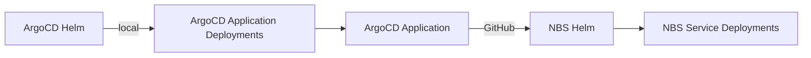

# NEDSS ArgoCD Application Deployment

## Overview
We recommend deploying NBS services using [Helm](https://helm.sh/](https://github.com/CDCgov/NEDSS-Helm/tree/nj-orgocd-testing/charts), a robust package manager for Kubernetes that streamlines application deployment and management.

For teams utilizing [Argo CD](https://argo-cd.readthedocs.io/en/stable/), Helm chart in this repository facilitates seamless configuration of ArgoCD Applications. [ArgoCD natively supports Helm charts](https://argo-cd.readthedocs.io/en/stable/user-guide/helm/), enabling declarative application definitions and synchronization of application states. This integration enhances continuous delivery workflows by ensuring that the deployed applications align with the desired configurations stored in your version control system.

This repository provides a Helm chart designed to deploy NBS7 ArgoCD Applications. Its primary purpose is to facilitate large-scale ArgoCD Applications deployments or upgrades of NBS7 services. This ensures consistent ArgoCD configurations across various environments while managing environment specific values files. Once deployed, users can efficiently manage each application through the Argo CD user interface.

### Install ArgoCD Applications

- If deploying in **Azure**, move Azure folder in templates directory
- `helm install nbs .\argocd -f .\argocd\<ADD-VALUES-FILE>.yaml --debug`

### Upgrade ArgoCD Applications

- `helm upgrade nbs .\argocd -f .\argocd\<ADD-VALUES-FILE>.yaml --debug`

### Delete ArgoCD Applications

- `helm uninstall nbs`
- `kubectl delete applications --all -n argocd`

## Notes
- Update Chart.yaml version, matching release tag when committing according to a release
- Deleting helm will not delete ArgoCD Applications.
    - If helm upgrade is failing or stuck, delete and deploy helm. Since ArgoCD Application are not deleted, previous Application will be updated.
- job-wait.yaml adds a sleep in order to orchestrate service deployment
- Following [hook](https://argo-cd.readthedocs.io/en/stable/user-guide/helm/#helm-hooks) annotations are required to allow helm orchestration
    - helm.sh/hook: post-install, post-upgrade = This annotation specifies that the associated resource should be executed after the installation (post-install) and after an upgrade (post-upgrade) of the Helm release.
    - helm.sh/hook-weight: "4" = This annotation assigns a weight to the hook, determining the order in which hooks are executed when multiple hooks of the same type are defined. Helm executes hooks with lower weights first. Weights can be positive or negative numbers but must be represented as strings.
    - helm.sh/hook-delete-policy: "hook-succeeded,hook-failed" = This annotation defines the deletion policies for the hook resource. The specified policies determine when the resource should be deleted after execution:
        - hook-succeeded: Delete the resource after the hook has successfully executed.
        - hook-failed: Delete the resource if the hook failed during execution.
